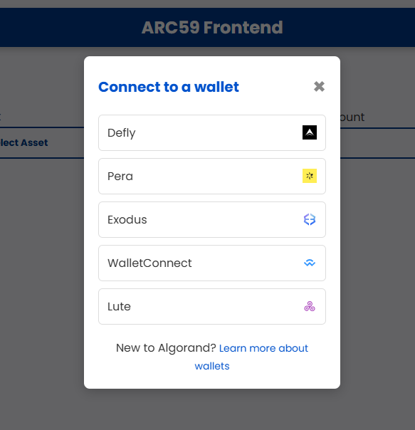
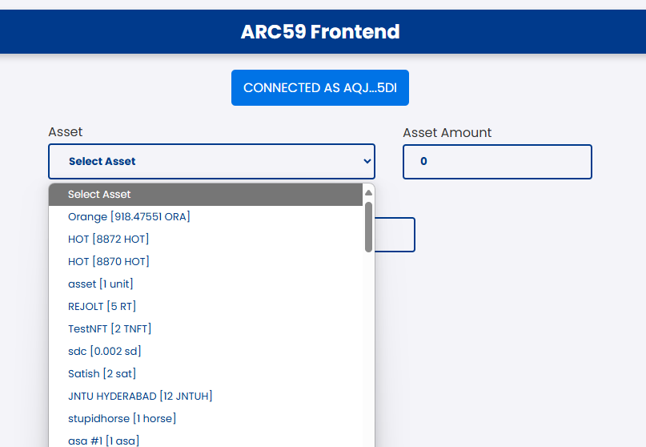
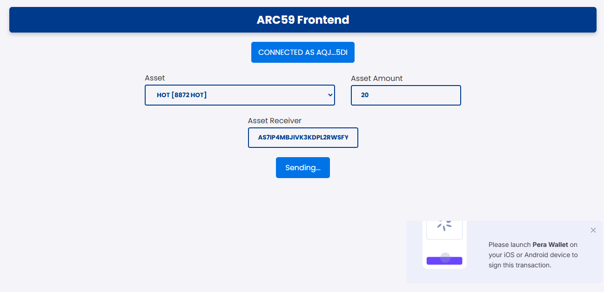
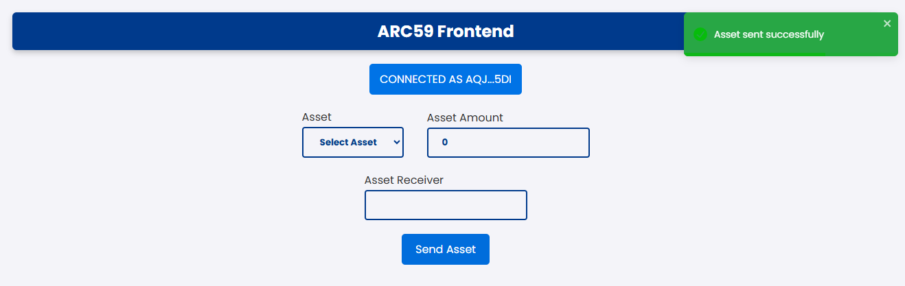

# ARC59 Frontend

A frontend interface for interacting with ARC59 (Asset Receive Contract) on the Algorand blockchain. This application allows users to send Algorand Standard Assets (ASAs) to recipient inboxes, even if the recipients haven't opted in to those assets yet.

This ARC59 Frontend is hosted on [Github Pages.](https://satishgaxl.github.io/arc59-frontend/dist/)

## What is ARC59?

[ARC59](https://github.com/algorandfoundation/ARCs/blob/main/ARCs/arc-0059.md) is an Algorand Request for Comments that defines a standard for enabling non-custodial asset transfers to recipients who haven't opted into the asset. It creates an "inbox" for recipients, allowing them to claim assets later or reject them.

## Features

- Connect multiple Algorand wallets (Pera, Defly, Exodus, WalletConnect, Lute)
- View and select assets from your wallet
- Send assets to any Algorand address, whether they've opted in or not
- Automatically handles all necessary transactions for ARC59 compliance
- User-friendly interface with toast notifications
- Testnet support

## Setup

### Prerequisites

- Node.js (v20 or later)
- NPM
- A compatible Algorand wallet

### Installation

1. Clone the repository:
```bash
git clone https://github.com/SatishGAXL/arc59-frontend.git
cd arc59-frontend
```

2. Install dependencies:
```bash
npm install
```

3. Run the development server:
```bash
npm run dev
```

4. Open your browser and navigate to `http://localhost:5173`

## Usage

### Sending Assets

1. Connect your wallet by clicking the "Connect Wallet" button

2. Select an asset from the dropdown menu

3. Enter the amount you wish to send
4. Enter the recipient's Algorand address
5. Click "Send Asset" & approve transactions in wallet.

6. Success Toast after successfully sending asset


The application will:
- Verify if the recipient is already opted into the asset
- If they are, send the asset directly
- If not, send the asset to their ARC59 inbox
- Handle all necessary minimum balance requirements (MBR)

## Technical Details

### Contract Integration

This frontend interacts with the ARC59 smart contract deployed at:
- Testnet: `643020148`
- Mainnet: `2449590623`

### Technology Stack

- React
- TypeScript
- Algorand SDK
- TxnLab's use-wallet-react for wallet connections
- AlgoKit Utils for Algorand interactions
- React Toastify for notifications

### Error Handling

The application handles various error scenarios:
- Invalid recipient addresses
- Insufficient balance
- Network issues
- Transaction failures

All error messages are displayed using toast notifications with detailed information.